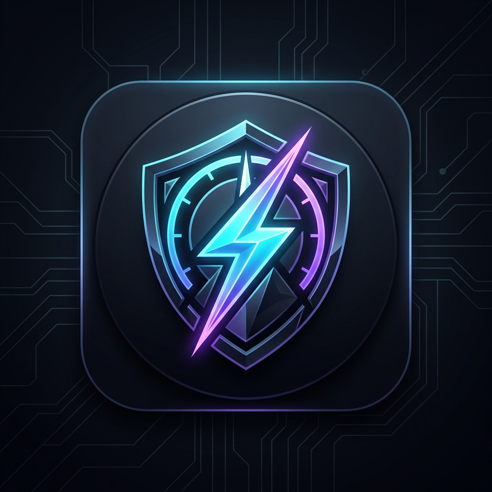

<p align="center">
  
</p>

<h1 align="center">⚡ SHOX — Windows System Performance & Freeze Guardian</h1>

<p align="center">
  <b>Ultra-fast, zero-dependency Windows system resource monitor, hang watchdog & floating taskbar mini-bar.</b>
</p>

<p align="center">
  <a href="https://www.python.org/"></a>
  <a href="https://microsoft.com/windows"></a>
  
  
  <a href="LICENSE"></a>
</p>

---

## 📖 Overview (Ta'aruf)

**SHOX** is an ultra-modern, high-performance Windows desktop watchdog built specifically for developers, gamers, and power users. It provides real-time system performance monitoring and intelligently tracks runaway memory/CPU consumption, all while keeping a constant vigil for **Not Responding (Frozen / Hung)** applications using native Windows APIs.

> **Urdu:** SHOX ek ultra-modern aur fast Windows utility hay jo real-time CPU, RAM, aur Disk usage dikhati hay, aur jab koi app hang hoti hay ya 1 minute se ziada continuous heavy resource use karti hay, toh foran alert aur 1-click **End Task** provide karti hay.

---

## 🌟 Key Highlights & Features

### 1. ⚡ Real-Time System Metrics
- **CPU Load:** Instant multi-core calculation via `GetSystemTimes`.
- **RAM Physical Memory:** Total, Used, Available GB and percentage with smooth progress indicators via `GlobalMemoryStatusEx`.
- **Disk Storage (C:):** Real-time free vs used space tracking via `GetDiskFreeSpaceExW`.

### 2. 🧊 Instant "Not Responding" (Freeze) Detection
- Communicates directly with the Windows window manager via native `user32.IsHungAppWindow`.
- The moment any application stops responding to the OS message loop, SHOX immediately triggers a **CRITICAL ALERT**, displays a floating toast notification, highlights the hung process in the table, and gives you a direct **"Force Kill / End Task"** option.

### 3. 🔥 Smart Sustained Usage Watchdog (> 1 Minute)
- **No Annoying Sounds / Spikes:** Temporary resource spikes (such as opening a browser tab or compiling code) do not trigger spam alerts.
- **Sustained Tracking:** Alerts and toast notifications are only fired if a background or foreground process continuously consumes heavy CPU/RAM for **over 60 seconds**.

### 4. 🌐 Real-Time Internet & Network Traffic Monitor
- **Active Socket Tracking:** Leverages Windows IP Helper API (`GetExtendedTcpTable`, `GetExtendedUdpTable`) to list every application actively using the internet or network ports.
- **Inspect Remote Connections:** View Process Name, PID, Protocol (TCP/UDP), Local Port, Remote IP, and Service type (e.g. `HTTPS`, `DNS`, `SSH`, `SMB`).
- **Live Bandwidth Speeds:** Real-time download (`↓ KB/s`) and upload (`↑ KB/s`) calculation via `GetIfTable2`.
- **1-Click Network Disconnect / End Task:** Instantly terminate suspicious background network connections.

### 5. 📌 Floating Mini Bar (Docked Above Taskbar Clock)
- Compact, frameless floating widget designed to sit unobtrusively directly above the Windows system clock.
- Shows live CPU, RAM, and real-time network speeds (`🌐 ↓0K ↑0K`).
- Fully draggable with a dedicated grip (`⋮⋮`) and 1-click expand (`⛶`) to the full dashboard.

### 6. 🎨 Obsidian Dark Modern UI (Zero Blur)
- **High-DPI Per-Monitor Aware:** Configured via `ctypes.windll.shcore.SetProcessDpiAwareness(2)` for razor-sharp rendering on 1080p, 2K, 4K, and high-DPI laptop displays.
- Custom vector canvas micro-bars, obsidian card styling, alternating table rows, and color-coded status badges.

### 7. 🚀 100% Zero External Dependencies
- Runs natively on any clean Windows installation! No `pip install`, no external C++ wheels, no psutil compilation required. Uses pure standard library `ctypes` and `tkinter`.

---

## 📁 Repository Structure

```
shox/
├── assets/
│   ├── shox_logo.png        # Official high-resolution logo (PNG)
│   ├── shox_logo.jpg        # High-definition source image
│   └── shox.ico             # Windows multi-resolution icon
├── app_gui.py               # Main Obsidian Dark dashboard (Tkinter UI)
├── mini_bar.py              # Floating mini bar widget (taskbar dock)
├── network_engine.py        # Native Win32 network & bandwidth engine
├── monitor_engine.py        # Native Win32 ctypes engine (CPU, RAM, Hung detector)
├── alert_manager.py         # Smart sustained 1-minute alert watchdog & history
├── toast_popup.py           # Smooth non-blocking desktop toast notifications
├── demo_freeze_app.py       # Test utility to safely simulate hung applications
├── main.py                  # CLI and GUI entry point (supports --mini flag)
├── run.bat                  # Double-click launcher for Full Dashboard
├── run_mini.bat             # Double-click launcher for Mini Bar View
├── test_system_full.py      # Automated integration test suite (9 tests)
├── .gitignore               # Clean git exclusions
├── LICENSE                  # MIT License
└── README.md                # Project documentation
```

---

## 🚀 Quick Start (Kaise Chalayein)

### Prerequisites
- Windows 10 or Windows 11 (64-bit or 32-bit)
- Python 3.10+ (Python 3.12 recommended)
- **No `pip` packages required!**

### Launching the Application

#### Option 1: Floating Mini Bar (Recommended for daily use)
Double-click [`run_mini.bat`](run_mini.bat) or run:
```powershell
python main.py --mini
```
*A sleek, unobtrusive bar will dock directly above your Windows taskbar clock.*

#### Option 2: Full Detailed Dashboard
Double-click [`run.bat`](run.bat) or run:
```powershell
python main.py
```
*Opens the comprehensive performance monitoring suite with search filters, sorting, and settings.*

---

## 🧪 Testing Freeze Detection

Want to verify how SHOX catches frozen programs?

1. Open a terminal and run the test simulator:
   ```powershell
   python demo_freeze_app.py
   ```
2. Click **"🧊 FREEZE THIS APP (15 Seconds)"** on the test window.
3. Instantly, SHOX will:
   - Blink the status badge to **`⚠️ 1 FROZEN!`**
   - Pop up a desktop toast notification with an **"End Task"** button.
   - Highlight the process in red in the Active Processes table.

---

## ⚙️ Architecture & Technical Details

```
   ┌────────────────────────────────────────────────────────┐
   │               Native Windows Subsystem                 │
   │  kernel32.dll  •  user32.dll  •  psapi.dll • shcore    │
   └───────────────┬────────────────────────┬───────────────┘
                   │                        │
                   ▼                        ▼
        ┌──────────────────────┐ ┌──────────────────────┐
        │ monitor_engine.py    │ │ toast_popup.py       │
        │ - GlobalMemoryStatus │ │ - Floating Toasts    │
        │ - GetSystemTimes     │ │ - 1-Click Kill Task  │
        │ - IsHungAppWindow    │ └──────────▲───────────┘
        └──────────┬───────────┘            │
                   │                        │
                   ▼                        │
        ┌──────────────────────┐            │
        │ alert_manager.py     ├────────────┘
        │ - 60s Sustained Rule │
        │ - Dedup & History    │
        └──────────┬───────────┘
                   │
         ┌─────────┴─────────┐
         ▼                   ▼
┌──────────────────┐ ┌──────────────────┐
│ app_gui.py       │ │ mini_bar.py      │
│ (Full Dashboard) │ │ (Taskbar Dock)   │
└──────────────────┘ └──────────────────┘
```

---

## 🧪 Running Automated Tests

To run the full suite of 9 integration tests:
```powershell
python -u test_system_full.py
```

Expected result:
```
==================================================
 [INFO] RUNNING SYSTEM MONITOR INTEGRATION TESTS
==================================================
[TEST 1] Memory Stats: PASSED
[TEST 2] Disk Stats: PASSED
[TEST 3] CPU Usage: PASSED
[TEST 4] Process Enumeration: PASSED
[TEST 5a] Sustained Check: PASSED
[TEST 5b] Sustained Alert Trigger: PASSED
[TEST 6] Not Responding Detector: PASSED
[TEST 7] GUI Modules: PASSED
[TEST 8] Network Connections: PASSED
[TEST 9] Network Bandwidth: PASSED
==================================================
 [SUCCESS] ALL 9 INTEGRATION TESTS PASSED SUCCESSFULLY!
==================================================
```

---

## 👤 Author & Credits

- **Developer:** [Abdul Moiz Ansari](https://github.com/AbdulMoizAns)
- **Project:** SHOX System Performance & Freeze Guardian

---

## 📄 License

This project is licensed under the [MIT License](LICENSE). Feel free to use, modify, and distribute for personal or commercial projects.
